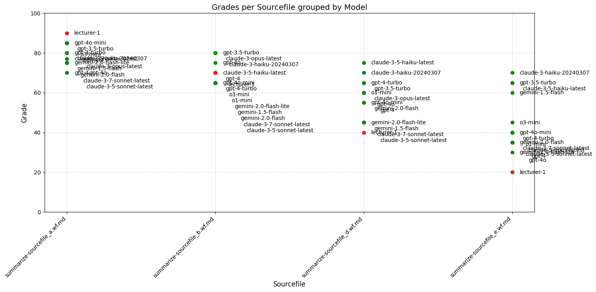
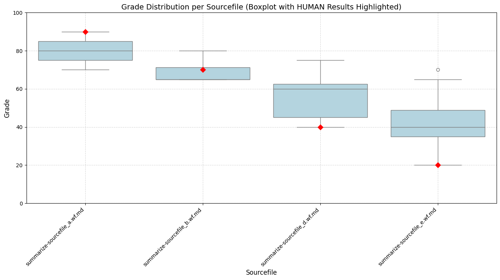

# Code-LLMs Benchmark

This repository contains the data of the benchmark tests investigating different cloud and local running LLMs to evaluate provided source-code projects.

The benchmarks are runned using the AICodeMentor project: https://github.com/BernLeWal/AICodeMentor

## Scenario Description

Beside existing benchmark for coding LLMs like https://huggingface.co/spaces/bigcode/bigcode-models-leaderboard, I want to evaluate the behavior of LLMs in specific scenarios where I have experiences in it 
- to evaluate submissions to software development exercises in the courses I train.

I am interested in how "well" the LLMs would evaluate and grade the handins (RQ1) and if they really "understand" the code and know what it does (RQ2).

### Programming Exercise

A (small) exercise was taken from one of my courses for bachelor students in 4th semester: create a RESTful web service in Java with Sprint Boot. (see [input/summarize-sourcefile-exercise.md](./input/summarize-sourcefile-exercise.md))

### Exercise Submissions

Different solutions from A-graded to E-graded have been prepared:
- [summarize-sourcefile_a](./input/summarize-sourcefile_a.wf.md) - a lecturer would grade it "A"
- [summarize-sourcefile_b](./input/summarize-sourcefile_b.wf.md) - a lecturer would grade it "B"
- [summarize-sourcefile_d](./input/summarize-sourcefile_d.wf.md) - a lecturer would grade it "D" (a lot of semantic errors and code flaws)
- [summarize-sourcefile_e](./input/summarize-sourcefile_e.wf.md) - a lecturer would grade it "E" - FAILED! (incomplete, does not compile, not understood RESTful services, not understood Spring Framework)

### Evaluated LLMs

The following cloud-based LLMs have been included in the benchmark tests:

OpenAI:
- "gpt-4o-mini",
- "gpt-4o",
- "gpt-4-turbo",
- "gpt-4",
- "gpt-3.5-turbo",

OpenAI Reasoning Models:
- "o3-mini",
- "o1-mini",
- "o1",

Google:
- "gemini-2.0-flash-lite",
- "gemini-2.0-flash",
- "gemini-1.5-flash",

Anthropic:            
- "claude-3-5-haiku-latest",
- "claude-3-opus-latest",
- "claude-3-haiku-20240307",
- "claude-3-7-sonnet-latest",
- "claude-3-5-sonnet-latest"

Remarks: Currently also small local-running, and on coding specialiced LLMs are tested. So more results to come soon :-)

### Benchmark Execution

The benchmarks were executed with [AICodeMentor](https://github.com/BernLeWal/AICodeMentor), you find the workflow-files and the batch-configuration in the [/input](./input/) subfolder.

The performance and results have been measured and stored in the [/output](./output/) subfolder, find the CSVs and LLMs outputs (as .md files) there:
- [summarize-sourcefile-cloud.csv](./output/summarize-sourcefile-cloud.csv)
    - Find the LLMs full-text output each in the subfolder [output/summarize-sourcefile-cloud_results/](./output/summarize-sourcefile-cloud_results/)
- [summarize-sourcefile-human.csv](./output/summarize-sourcefile-human.csv)
    - Find the LLMs full-text output each in the subfolder [output/summarize-sourcefile-cloud_results/](./output/summarize-sourcefile-human_results/)

## Analytics

The analytics and diagrams are done using Jupyter-Notebooks:
- Analyze how the LLMs would grade (from 0..100) the exercise-samples: [analyze_grade.ipynb](analyze_grade.ipynb)

... more to come soon ;-)

## Results

### Grades per Sourcefile (grouped by submission-category)

The grading results of a human lecturer are contained in the graphics, shown in red color and labeled as "lecturer-1".

### Grade distribution per Sourcefile (Boxplot with HUMAN Results highlighted)

The grading results of a human lecturer are contained in the graphics, shown by the red diamonds.

### Conclusion

For the "good" samples (A and B) the grading-results of the LLMs would approximately fit to the result of the lecturer, but the "bad" samples (D and E) would only be a little lower graded the good ones - the human lecturer would empathize the failures much higher and in the real course, both would fail.

It looks like that the major problems with the code have not been recognized enough by the LLMs.

Provocative hypothesis: LLM used in **"zero-shot"** does not "understand" the code, but will likely base the results on found keywords and easily missinterpret the source.

Without further supportive measures from us teachers and chain-of-tought principles would not be of too much help in our daily work when grading and evaluating student submissions.
