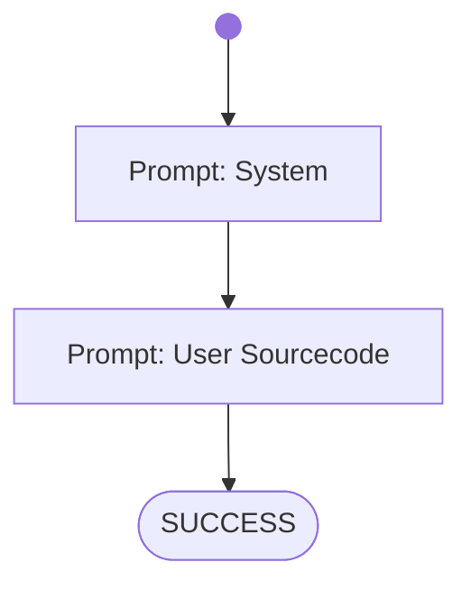

# Summarize Sourcefile

Used for benachmarking different AIAgents and Models.

Try it out! From the project directory run:

on Windows:
```shell
bin\build_codementor.ps1
bin\run_codementor.ps1 workflows/benchmarks/summarize-sourcefile.wf.md
```
on Linux:
```shell
bin\build_codementor.ps1
bin\run_codementor.ps1 workflows/benchmarks/summarize-sourcefile.wf.md
```


# Workflow



# Prompts

## System

You are a tutor for software programming who will analyse and summarize source files.
Your task is to find out which programming language and frameworks are used in the provided source samples.
Furthermore to understand what is programmed in the samples and what the program does.
If you find problems in the sourcecode then state them.

Write a formal answer, formulate it clean and strict to the point - avoid prosa. 
Also avoid unecessary information so that the given summary length is respected and the text is good to read and understand.

## User Sourcecode

Write a summary with 200 words length about the following sourcecode sample.
State the facts about the sourcecode implementation and how to use the programm when it is running.
Order them from highest priority to lowest.
Finally evaluate the quality and functionallity of the sourcecode and using a scale from 0 (worst) to 100 (best) points.

```
package at.fhtw.weather.exercise;

import org.springframework.boot.SpringApplication;
import org.springframework.boot.autoconfigure.SpringBootApplication;
import org.springframework.http.HttpStatus;
import org.springframework.http.ResponseEntity;
import org.springframework.web.bind.annotation.*;

import java.util.Collection;
import java.util.HashMap;
import java.util.List;

@SpringBootApplication
@RestController
@RequestMapping("/city")
public class WeatherServiceApplication {

    public record WeatherRecord(int id, String city, String weather, double temperature, String date) {}
    private HashMap<Integer, WeatherRecord> repository = new HashMap<>();

    public WeatherServiceApplication() {
        repository.put(1, new WeatherRecord(1, "Vienna", "cloudy", 13.1, "2025-04-01"));
        repository.put(2, new WeatherRecord(2, "Prague", "sunny", 17.3, "2025-04-02"));
        repository.put(3, new WeatherRecord(3, "Berlin", "sunny", 16.5, "2025-04-02"));
        repository.put(4, new WeatherRecord(4, "Munich", "rainy", 10.8, "2025-04-03"));
    }

    //get specific city weather and temperature data
    @GetMapping("/{id}")
    public ResponseEntity<WeatherRecord> getRecord(@PathVariable("id") int id) {
        var data = repository.get(id);
        if ( data==null )
            return new ResponseEntity<>(HttpStatus.NOT_FOUND);
        return new ResponseEntity<>(data, HttpStatus.OK);
    }

    //get all city weather data
    @GetMapping
    public Collection<WeatherRecord> getRecords() {
        return repository.values();
    }

    //add city weather/temperature data
    @PostMapping("/add")
    @ResponseStatus(HttpStatus.CREATED)
    public void addRecord(@RequestBody WeatherRecord newRecord) {
        repository.put(newRecord.id(), newRecord);
    }

    //update city weather/temperature data
    @PutMapping("/update/{id}")
    public ResponseEntity<WeatherRecord> updateRecord(@RequestBody WeatherRecord updatedRecord, @PathVariable("id") int id) {
        if ( !repository.containsKey(id) )
            return ResponseEntity.notFound().build();
        var tempRec = new WeatherRecord(id, updatedRecord.city, updatedRecord.weather, updatedRecord.temperature, updatedRecord.date);
        repository.put(id, tempRec);
        return ResponseEntity.ok(tempRec);
    }

    //delete city weather data
    @DeleteMapping("/delete/{id}")
    public ResponseEntity deleteRecord(@PathVariable("id") int id) {
        if ( repository.remove(id) == null)
            return new ResponseEntity(HttpStatus.NOT_FOUND);
        return new ResponseEntity(HttpStatus.NO_CONTENT);
    }

    public static void main(String[] args) {
        SpringApplication.run(WeatherServiceApplication.class, args);
    }
}
```
