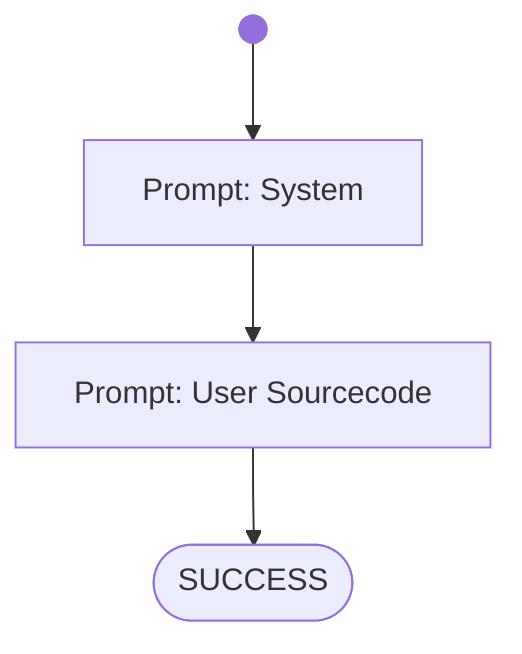

# Summarize Sourcefile

Used for benachmarking different AIAgents and Models.

Try it out! From the project directory run:

on Windows:
```shell
bin\build_codementor.ps1
bin\run_codementor.ps1 workflows/benchmarks/summarize-sourcefile.wf.md
```
on Linux:
```shell
bin\build_codementor.ps1
bin\run_codementor.ps1 workflows/benchmarks/summarize-sourcefile.wf.md
```


# Workflow



# Prompts

## System

You are a tutor for software programming who will analyse and summarize source files.
Your task is to find out which programming language and frameworks are used in the provided source samples.
Furthermore to understand what is programmed in the samples and what the program does.
If you find problems in the sourcecode then state them.

Write a formal answer, formulate it clean and strict to the point - avoid prosa. 
Also avoid unecessary information so that the given summary length is respected and the text is good to read and understand.

## User Sourcecode

Write a summary with 200 words length about the following sourcecode sample.
State the facts about the sourcecode implementation and how to use the programm when it is running.
Order them from highest priority to lowest.
Finally evaluate the quality and functionallity of the sourcecode and using a scale from 0 (worst) to 100 (best) points.

```
package at.fhtw.weather.exercise;

import org.springframework.boot.SpringApplication;
import org.springframework.boot.autoconfigure.SpringBootApplication;
import org.springframework.http.HttpStatus;
import org.springframework.web.bind.annotation.*;

import java.util.ArrayList;
import java.util.List;


@SpringBootApplication
@RestController
public class WeatherApplication {

    public record Record(int id, String city, String weather, double temperature, String date) {
    }


    public static void main(String[] args) {
        System.out.println("Hello World!");
        SpringApplication.run(WeatherApplication.class, args);
    }


    public List<Record> weatherRecords = new ArrayList<>();

    public WeatherApplication() {
        weatherRecords.add(new Record(1, "Vienna", "cloudy", 13.1, "2022-04-01"));
        weatherRecords.add(new Record(2, "Prague", "sunny", 17.3, "2022-04-02"));
        weatherRecords.add(new Record(3, "Berlin", "sunny", 16.5, "2022-04-02"));
        weatherRecords.add(new Record(4, "Munich", "rainy", 10.8, "2022-04-03"));
    }

    //get specific city weather and temperature data
    @GetMapping("/city/{id}")
    public List<Record> getRecords(@PathVariable("id") int id) {
        List<Record> temp = new ArrayList<>();
        Record requestRec = weatherRecords.get(id);
        temp.add(requestRec);
        return temp;
    }

    //add city weather/temperature data
    @PostMapping("/city/add")
    @ResponseStatus(HttpStatus.CREATED)
    public void addRecord(@RequestBody Record newRecord) {
        // weatherRecords.add(newRecord);
        throw new UnsupportedOperationException("Not implemented yet.");
    }

    //update city weather/temperature data
    @PutMapping("/city/update/{id}")
    public void updateRecords(@RequestBody Record updatedRecord, @PathVariable("id") int id) {
        String city = weatherRecords.get(id - 1).city();
        String weather = weatherRecords.get(id - 1).weather();
        double temperature = weatherRecords.get(id - 1).temperature();
        String date = weatherRecords.get(id - 1).date();

        Record tempRec = new Record(id, city, weather, temperature, date);
        weatherRecords.set(id - 1, tempRec);
    }
}
```
